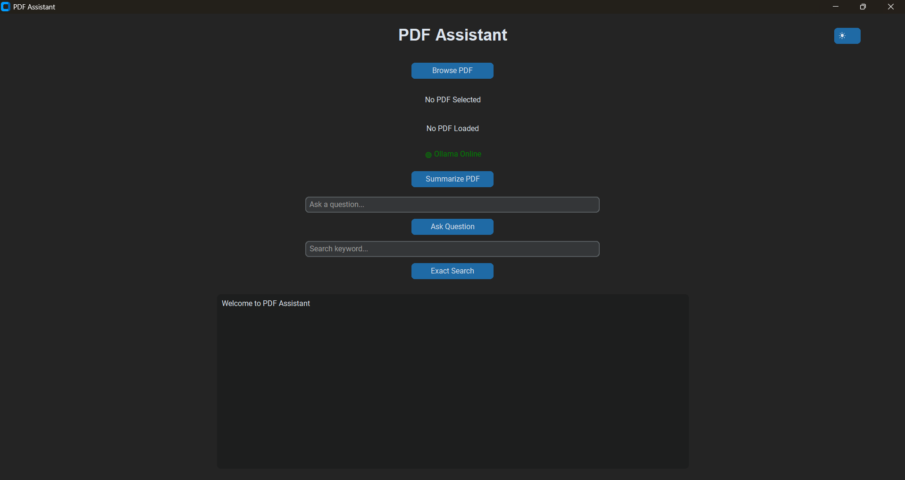
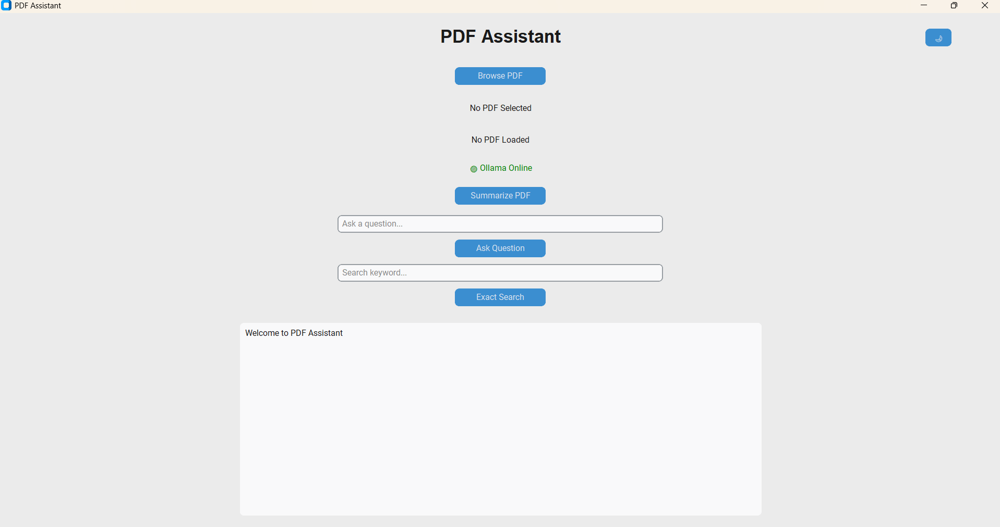
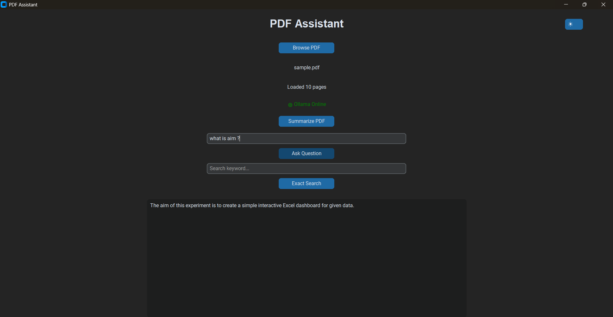
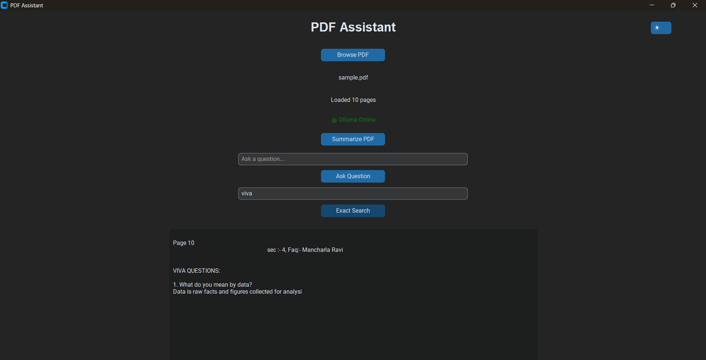
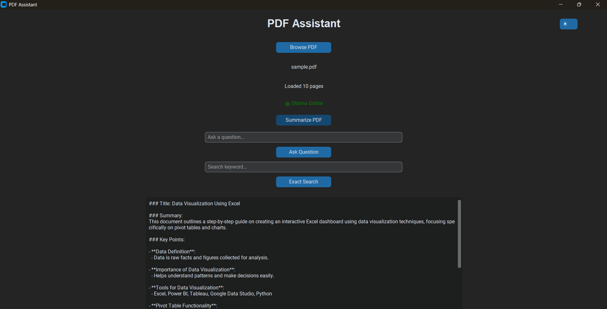

# PDF Assistant v1

AI-powered PDF Assistant built with Python, CustomTkinter, and Ollama.

This application allows users to load PDF documents, generate summaries, ask questions about document content, and perform exact keyword searches using a local Large Language Model (LLM).

## Features

- PDF document loading
- AI-powered document summarization
- Question Answering based on PDF content
- Exact keyword search with page references
- Dark / Light theme toggle
- Ollama connection status indicator
- Local processing (no cloud API required)
- Invalid PDF error handling

## Screenshots

### Dark Theme


### Light Theme


### Question Answering


### Exact Search


### Summary Generation


## Project Structure

```text
pdf-assistant-v1/
│
├── gui.py
├── llm.py
├── pdf_reader.py
├── cli_version.py
├── requirements.txt
│
├── sample_files/
│   └── sample.pdf
│
└── screenshots/
```

## Technologies Used

- Python
- CustomTkinter
- Ollama
- Qwen 2.5 (1.5B)
- PyPDF
- Requests

## Installation

### 1. Clone Repository

```bash
git clone https://github.com/AyushmanAryan/pdf-assistant-v1.git

cd pdf-assistant-v1
```

### 2. Install Dependencies

```bash
pip install -r requirements.txt
```

### 3. Install Ollama

Download and install Ollama:

https://ollama.com

### 4. Pull the Model

```bash
ollama pull qwen2.5:1.5b
```

### 5. Run the Application

```bash
python gui.py
```

## How It Works

1. Select a PDF document.
2. The PDF text is extracted and converted into context.
3. Ollama processes the document locally.
4. Users can:
   - Generate summaries
   - Ask questions
   - Search keywords
5. Results are displayed inside the desktop application.

## Future Improvements

- RAG (Retrieval-Augmented Generation)
- Embedding-based semantic search
- Multi-PDF support
- Chat history
- OCR support for scanned PDFs
- Export summaries to text files

## Author

Ayushman Aryan

GitHub: https://github.com/AyushmanAryan

## License

This project is released for educational and learning purposes.
